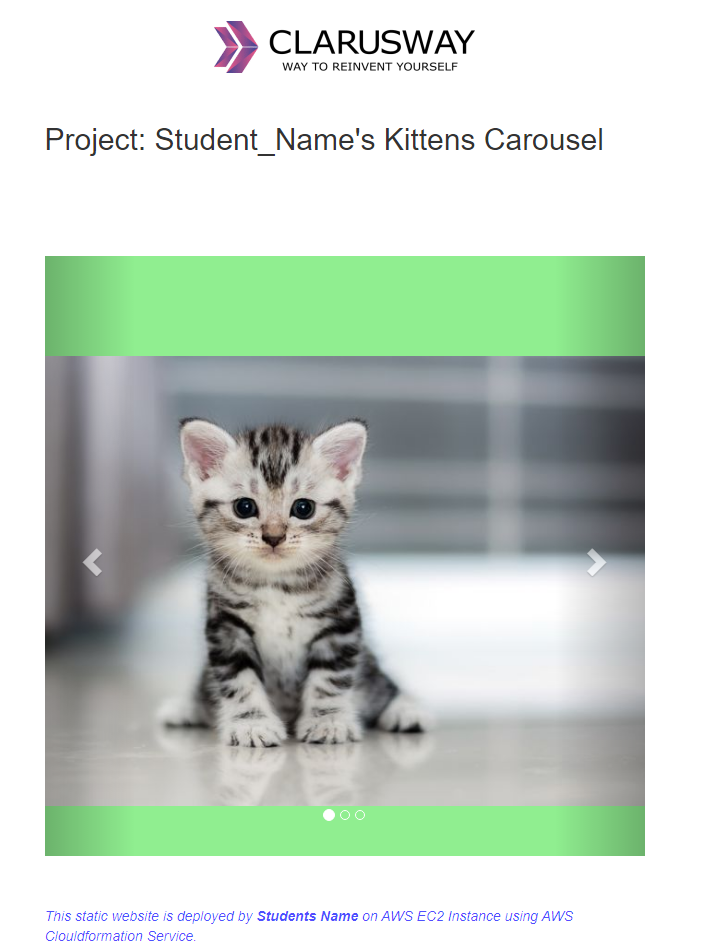

# AWS EC2 Static Website Deployment with CloudFormation

## Overview

This project demonstrates how to deploy a static website on an Amazon EC2 instance using **AWS CloudFormation** for infrastructure provisioning and **Apache HTTP Server** for web hosting.

The infrastructure is created automatically using an Infrastructure as Code (IaC) approach, while the application files are deployed through an EC2 User Data script during instance initialization.

---

## Architecture

* AWS CloudFormation
* Amazon EC2 (Amazon Linux 2)
* Apache HTTP Server
* EC2 User Data
* Security Groups
* Static HTML/CSS Website

---

## Project Structure

```text
.
├── kittens-carousel-static-website.yml
├── static-web
│   ├── index.html
│   ├── cat0.jpg
│   ├── cat1.jpg
│   ├── cat2.jpg
│   └── cat3.png
├── project-101-snapshot.png
├── Pro_Project_101.png
└── README.md
```

---

## Features

* Infrastructure provisioning using AWS CloudFormation
* Automatic EC2 instance creation
* Apache Web Server installation via User Data
* Static website deployment during instance initialization
* Public HTTP access through Security Groups
* Infrastructure as Code (IaC) approach

---

## Technologies Used

* AWS CloudFormation
* Amazon EC2
* Amazon Linux 2
* Apache HTTP Server
* Bash
* HTML
* Git & GitHub

---

## Deployment

1. Launch the CloudFormation template.
2. Create the required AWS resources.
3. Wait until the stack reaches **CREATE_COMPLETE**.
4. Open the EC2 Public DNS or Public IP address in your browser.
5. Verify that the static website is accessible.

---

## Project Preview



---

## Learning Outcomes

This project demonstrates practical experience with:

* Infrastructure as Code (IaC)
* AWS CloudFormation
* EC2 provisioning
* Apache Web Server configuration
* Linux User Data automation
* Static website deployment
* Git version control

---

## Author

Eyüp İlhan
